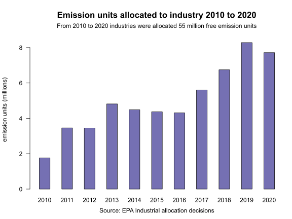

# Free emissions units under the emissions trading scheme?

### Industrial allocation of free emissions units to industry 2010 to 2020

the Emissions Trading Scheme [Industrial Allocation](https://www.epa.govt.nz/industry-areas/emissions-trading-scheme/industrial-allocations/)

If I need a one-liner about emissions trading schemes, [Motu]((https://www.motu.nz/) are my go-to. 

For example, from the opening paragraph of [A Guide to the New Zealand Emissions Trading Scheme 2018](https://www.motu.nz/assets/Documents/our-research/environment/climate-change-mitigation/emissions-trading/A-Guide-to-the-New-Zealand-Emissions-Trading-System-2018-Motu-Research.pdf)

> _An emissions trading scheme sets a legal limit on emissions by regulated emitters and translates that limit into a market price which changes behaviour to reduce emissions_ 

How does that work? More from Motu on how an emissions trading scheme functions.

1. Emitters are required to surrender to the government a tradable emission unit for each tonne of emissions. 
1. The government limits the supply of emission units into a trading market. 
1. That then sets the emission price based on unit supply and demand. 
1. The cost to emitters of surrendering emission units gets passed down the supply chain.
1. That raises the relative cost of higher-emission goods and services. 
1. That makes lower-emission behaviour more competitive, and incentivises reduction of emissions.

How do the units get to the market? Emitters can potentially acquire emission units in five ways:

1. Buying them from other emitters 
1. Buying them at auction (generating government revenue that can be returned to the economy) 
1. Earning them by removal activities (carbon storage in forests) 
1. Buying them as offsets or through international trading.
1. Receiving them for free - [Industrial Allocation](https://www.epa.govt.nz/industry-areas/emissions-trading-scheme/industrial-allocations/)

 

