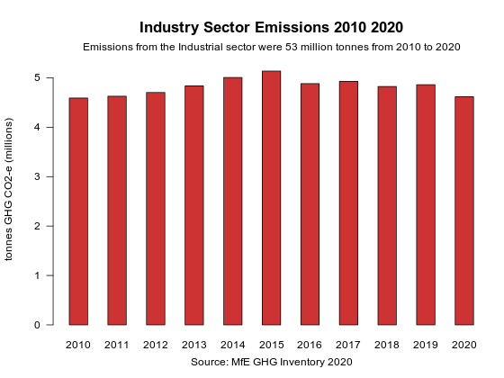

# Free emissions units under the emissions trading scheme?

### industrial allocation of emissions units 2010 to 2020

the Emissions Trading Scheme [Industrial Allocation](https://www.epa.govt.nz/industry-areas/emissions-trading-scheme/industrial-allocations/)

 

