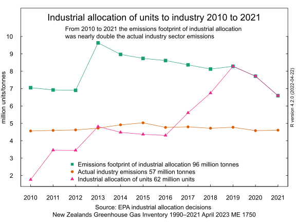

# Industrial allocation - free emissions units given to emitter industries in New Zealand

## Industrial allocation exempts from pricing twice as many tonnes of emissions than the total emissions for the Industry sector 15 December 2022

This line chart also shows the 55 million emission units allocated to industries.

Here is a pie chart of the quantities of free emission units allocated to industries. Note the highly regressive distribution favouring major corporates. Of the 55 million units, 49 million went to ten companies.

Here is a pie chart of the percentages of free emission units allocated to industries. Again note the highly regressive distribution favouring major corporates. 89 percent of all units allocated went to ten companies.

Here is a barplot of the 53 million tonnes of actual emissions from the New Zealand industrial sector from the [Greenhouse Gas Inventory](https://environment.govt.nz/facts-and-science/climate-change/measuring-greenhouse-gas-emissions/about-new-zealands-greenhouse-gas-inventory/).

Here is a line chart of the 53 million tonnes of actual emissions and the Industrial Allocation - the free allocation of the 55 million emission units.

So at first glance it appears that the amount of free emission units allocated cancel out the actual industry emissions. This suggests that in a net sense the industry sector emissions are not priced at all under the emissions trading scheme They are more than 'offset' by the allocation of free units. 

So it's the same net result as if the industry sector was completely exempted from the emissions trading scheme requirements to surrender emission units equal to their emissions.

However I am missing a step in my analysis. In my detailed examples for New Zealand Steel and New Zealand Aluminium Smelters, I estimated the actual liability to surrender units by multiplying the Greenhouse Gas Inventory steel and aluminium emissions by a variable representing the "two for one" discount introduced in 2009 by the Hon Dr Nick Smith when he was the Minister for Climate Changes Issues.

On 1 September 2009 with Dr Smith's approval ["Emissions trading bulletin No 11: Summary of the proposed changes to the NZ ETS"](https://environment.govt.nz/publications/emissions-trading-bulletin-no-11-summary-of-the-proposed-changes-to-the-nz-ets/summary/) was published. It stated that the emissions trading scheme would be amended by adding a transition phase lasting to 31 December 2012 which would feature a "progressive obligation".

The 'progressive obligation' was effectively a 50% discount on the 'surrender obligation', the quantity of emissions units that emitters had to surrender. Each firms industrial allocation of emission units would in consequence also be halved as well.

Then in 2012, Minister for Climate Change Issues Tim Groser introduced the [Climate Change Response (Emissions Trading and Other Matters) Amendment Bill](https://www.legislation.govt.nz/bill/government/2012/0052/13.0/DLM4812000.html). This bill extended the life of the "two for one" 'progressive obligation' indefinitely.

Finally, in 2016, Minister for Climate Change Issues Paula Bennett introduced a bill to "phase out" the 'progressive obligation' over three years from 2017 to 2019 by increments from the original "two for one" - 2 units per tonne to 1.5 to 1.2 to 1 unit per tonne of emissions. See the ["EPA document ETS Surrender Obligations One for two phase out factsheet"](https://www.epa.govt.nz/assets/Uploads/Documents/Emissions-Trading-Scheme/Guidance/ETS-Surrender-Obligations-One-for-two-phase-out-factsheet.pdf)

So I need to include a discount variable that is then multiplied by the free emission units allocated to result in the "emissions footprint" of the allocation of units. The discount variable is 0.25 for 2010 (half obligation for half a year),then 0.5 from 2011 to 2016, 0.67 in 2017 ,0.83 in 2018 and finally one for one for 2019 and 2020.

This allows me to estimate of the [carbon footprint](https://www.britannica.com/science/carbon-footprint) or [emissions footprint](https://www.sciencedirect.com/topics/engineering/emission-footprint) of all the units given under Industrial Allocation. As in this chart.

I can then add the 'emissions footprint' values or the emissions allowed by the free Industrial Allocation units to the chart of allocated emission units and actual industry emissions.

The chart shows a huge gap between the emissions footprint and the allocated units until 2017 when the two lines start to converge. Then in 2019, the emissions foot print is the same as the units allocated as finally, under the emissions trading scheme, one emission unit does in fact equate to one tonne of emissions. The total of the Industrial Allocation 'emissions footprint' over 2010 to 2020 is 89 million tonnes. Those 89 million tonnes have been exempted or "de-priced" by the emissions trading scheme.

Just a reminder. What is an emission unit? It's a right to emit greenhouse gases to the atmosphere. Owning an emission unit is the same as permission to emit a quantity of greenhouse gases whether from smelting or just from burning coal oil or gas. Being allocated a unit is the same as being told "go for it - you can just burn coal or oil or gas without penalty until a tonne of carbon dioxide is in the atmosphere". It's the opposite of a price on carbon. It's a permit or licence to burn carbon.

How can that possibly be the case? It is because of the [electricity allocation factor](https://web.archive.org/web/20110712151351/http://www.climatechange.govt.nz/emissions-trading-scheme/building/regulatory-updates/eaf-update.html). The 'emissions factors' used in allocation include a factor for upstream ETS related electricity price increases.

Industrial Allocation therefore "de-prices" and removes the emissions price signal from some energy sector emissions in addition to the direct industry process emissions.

In a net sense Industrial Allocation is worse as a policy to reduce industry emissions than a complete exemption of industry from the emissions trading scheme. In a scenario of 100% exemption, at least all electricity and energy sector carbon emissions would in theory be priced.

# Industrial over allocation - why were there 55 million free emission units when total industry sector emissions were 53 million tonnes? 7 December 2022

How does it make any sense that the 55 million free emission units gifted to big emitters under Industry Allocation exceed the total emissions of the industry sector, 53 million tonnes, from 2010 to 2020?

In a [recent post](https://rwmjohnson.blogspot.com/2022/11/industrial-allocation-free-emissions.html) I noted that 55 million free emission units had been allocated to industries over the eleven years from 2010 to 2020. I presented a barplot of the 'Industrial Allocation' of free emissions units given to emitting industries by the Environmental Protection Authority under the New Zealand emissions trading scheme.

I left open the question "is 55 million free emission units (over eleven years) a big number?"

The Ministry for the Environment doesn't seem to think so. Their website page on Industrial Allocation states the following;

I call this the consultants fallacy. It has the form "put small number next to big number" and therefore "effects are minor" and grant me my resource consent.

You have a number you wish to defend; 4.3 million free units allocated in 2016. You compare it to a related bigger number; in 2016 emitters surrendered 19.5 million emission units under the emissions trading scheme. Premises then conclusion: 4.3 million is smaller (only 22 per cent of) than 19 million. A relatively small proportion therefore it's a small number of units being given away for free to dirty polluting emitters.

Wouldn't the actual emissions from the industry sector as recorded in the Greenhouse Gas Inventory be a better comparion with the actual free allocation of units? The inventory tells us the actual emissions from industries were 4.6 million tonnnes in 2016.

How does that fit with my theory that industrial allocation is over allocation? Fewer units were allocated (4.3m) than the 2016 actual industry emissions! (4.6mt) Well at least 300,000 tonnes of industry emissions were in some sense 'priced' by the emissions trading scheme in 2016.

What's the result if we add up the inventory emissions from industry for the same period as the Industrial allocation spreadsheet from the EPA (11 years 2010 to 2020).

The result is that the industry emissions (from the inventory) were 53 million tonnes and the emissions units given away under Industrial Allocation were 55 million.

So to make it simple. The emissions trading scheme makes New Zealand industry liable to surrender emissions units for it's emissions.

Okay we get it. It's "polluter pays". But the Industrial Allocation rules have given some industries more emission units than the emissions of the entire industry sector! It's almost equivalent to exempting the whole industrial sector from the emissions trading scheme.

But it's worse than that. The allocations of emissions units are heavily weighted towards the highest quantity emitters: The top ten recipients received 89% of the units. The other 152 recipients got 11% of the units. New Zealand Aluminium Smelters Limited and New Zealand Steel Limited received about 45% of all the allocated free units.

